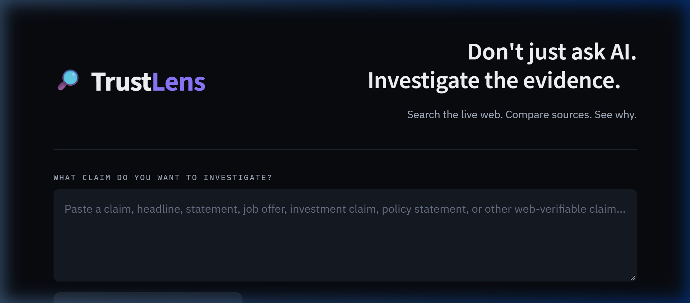
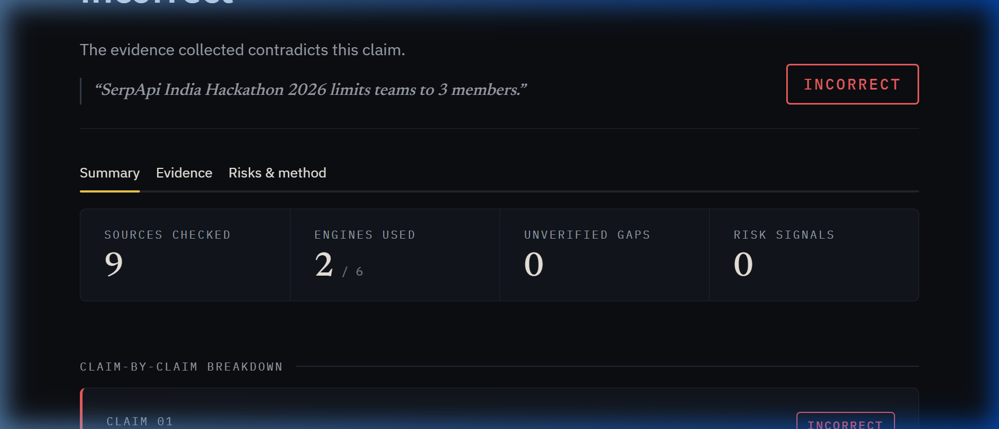
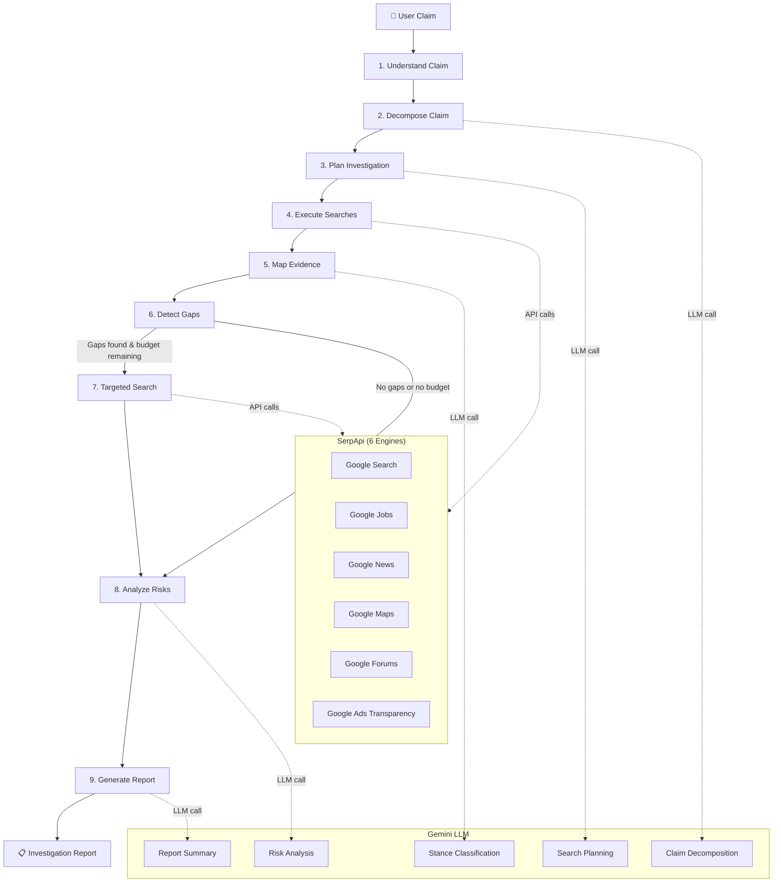

# 🔎 TrustLens

### AI-Powered Claim Verification & Evidence Intelligence

> **Enter a claim. TrustLens investigates the live web, collects evidence from multiple sources, separates what supports it from what contradicts it, and delivers an evidence-backed assessment — not a black-box score.**

**Track:** Knowledge & Public Interest  
**Hackathon:** [SerpApi India Hackathon 2026](https://serpapi.com)

---

## 📌 The Problem

People encounter claims every day — on social media, in job offers, investment pitches, product pages, and forwarded messages. Verifying them is hard:

- **Manual fact-checking is slow.** You'd need to open multiple tabs, cross-reference sources, and piece together context yourself.
- **A simple AI answer isn't enough.** Large language models can hallucinate. A confident-sounding answer with no sources is just another claim.
- **Binary YES/NO verdicts are misleading.** Real-world claims are often partly correct, context-dependent, or outdated. Users need to see *the evidence*, not just a label.

What's missing is an investigative tool that searches the live web, gathers real evidence, and shows users *what was found and where* — so they can judge for themselves.

---

## 💡 The Solution

TrustLens is an **autonomous claim investigation system**. When a user submits a claim:

1. It decomposes the claim into individually verifiable sub-claims.
2. It builds a search strategy and queries the live web across **multiple specialized search engines** via SerpApi.
3. It classifies each piece of evidence as **supporting**, **contradicting**, or **neutral**.
4. It identifies evidence gaps and runs targeted follow-up searches.
5. It presents a transparent, source-backed report — with links, excerpts, and corrections where applicable.

TrustLens does **not** claim to determine absolute truth. It provides an **evidence-based assessment** drawn from current web data, with full source traceability.

---

## 🧩 Why TrustLens?

| Aspect | Typical Chatbot / Search Engine | TrustLens |
|---|---|---|
| **Workflow** | User asks a question, gets an answer | User submits a claim, gets an *investigation* |
| **Evidence** | Hidden or absent | Every finding links back to a real source |
| **Stance Analysis** | None | Each source classified as supporting, contradicting, or neutral |
| **Decomposition** | Treats claim as one block | Breaks claim into atomic sub-claims, each verified independently |
| **Gap Awareness** | Silent about what it can't find | Explicitly reports evidence gaps and runs follow-up searches |
| **Transparency** | Black-box reasoning | Full methodology note, risk indicators, and limitations disclosed |

---

## ⚙️ How It Works

TrustLens runs a **9-node LangGraph pipeline** that orchestrates the entire investigation:

```
User Claim
    ↓
┌─────────────────────────────────┐
│ 1. Understand Claim             │  Parse input, fetch any provided URLs
│ 2. Decompose Claim              │  Break into atomic sub-claims (Gemini)
│ 3. Plan Investigation           │  Select engines & queries per sub-claim (Gemini)
│ 4. Execute Searches             │  Run queries via SerpApi (up to 5 calls)
│ 5. Map Evidence                 │  Classify each result's stance (Gemini)
│ 6. Detect Gaps                  │  Identify claims with no direct evidence
│ 7. Targeted Search (if needed)  │  Follow-up SerpApi queries for gaps
│ 8. Analyze Risks                │  Flag risk patterns from evidence (Gemini)
│ 9. Generate Report              │  Assemble final investigation report
└─────────────────────────────────┘
    ↓
Evidence-Backed Investigation Report
```

**Stage-by-stage breakdown:**

| Stage | What Happens |
|---|---|
| **Understand Claim** | Parses the user's input. If URLs are included, fetches their page content as primary evidence context. |
| **Decompose Claim** | Uses Gemini to split the claim into atomic sub-claims, each with a type (Job Offer, Company Claim, Product Claim, etc.) and key entities. |
| **Plan Investigation** | Gemini selects which SerpApi engines and queries are most relevant for each sub-claim — e.g., a job claim triggers Google Jobs + Google News, not Google Maps. |
| **Execute Searches** | Runs the planned queries through SerpApi. Results are deduplicated and normalized (tracking parameters stripped, URLs canonicalized). |
| **Map Evidence** | Each search result's snippet is classified by Gemini as SUPPORTING, CONTRADICTING, NEUTRAL, or IRRELEVANT relative to its assigned sub-claim. Corrections and evidence excerpts are extracted. |
| **Detect Gaps** | Identifies sub-claims that received zero supporting or contradicting evidence. If budget allows, triggers targeted follow-up searches. |
| **Targeted Search** | Runs additional SerpApi queries specifically for evidence-starved claims. |
| **Analyze Risks** | Gemini examines the full evidence set for red-flag patterns (unrealistic salary, no physical presence, upfront payment requests, etc.). |
| **Generate Report** | Assembles the final report with per-claim findings, overall status, source links, risk indicators, limitations, and a methodology note. |

---

## 🔍 SerpApi Integration

SerpApi is the **core evidence retrieval layer** of TrustLens. Without it, TrustLens would have no access to live web data — the entire investigation pipeline depends on real-time search results from SerpApi.

### How SerpApi Is Used

TrustLens uses a **6-engine search strategy**, routing queries to the most appropriate SerpApi engine based on claim type. The AI planner (Gemini) dynamically selects which engines to query — it does *not* blindly call every engine for every claim.

| SerpApi Engine | SerpApi `engine` Parameter | TrustLens Usage | Why It Matters |
|---|---|---|---|
| **Google Search** | `google` | Cross-references baseline facts, company info, reviews, and general web presence | Broadest evidence source for any claim type |
| **Google Jobs** | `google_jobs` | Validates job offers — checks if the company is actually hiring for the claimed role | Catches fabricated job listings and unrealistic offers |
| **Google News** | `google_news` | Scans for recent news coverage, press releases, scam reports, or corporate announcements | Surfaces time-sensitive context that general search may miss |
| **Google Maps** | `google_maps` | Verifies physical business presence — address, ratings, reviews | Exposes shell companies with no verifiable location |
| **Google Forums** | `google_forums` | Aggregates real user discussions, complaints, and community experiences | Captures grassroots sentiment that official sources won't show |
| **Google Ads Transparency Center** | `google_ads_transparency_center` | Checks advertiser identity, active ad campaigns, and official advertiser names | Verifies whether an entity is a registered Google advertiser |

### The Search Workflow in Code

1. **`providers/serpapi.py`** — The `SerpApiProvider` class handles all SerpApi communication. Each engine has custom parameter mapping (`_build_params`) and result normalization (`_normalize_results`). Results are returned as typed `SearchResult` objects with title, URL, snippet, source, hostname, publication date, engine, position, and raw data.

2. **`workflow/graph.py` → `execute_searches`** — The LangGraph node iterates over planned search tasks, calls `SerpApiProvider.search()` for each, and collects results. A hard cap of **5 SerpApi calls per investigation** keeps API usage predictable.

3. **`workflow/graph.py` → `targeted_search`** — If gaps are detected, additional SerpApi queries are issued against the remaining budget.

4. **`providers/normalization.py`** — Deduplicates results by normalized URL (strips tracking parameters like `utm_*`, `fbclid`, `gclid`) before evidence mapping.

### What Would Be Lost Without SerpApi

If live search were removed, TrustLens would have **no evidence to work with**. The LLM alone cannot verify claims — it would just be generating text from its training data. SerpApi provides the real-time, multi-source web data that makes TrustLens an *investigator* rather than a chatbot.

---

## ✅ Key Features

- **Claim Decomposition** — Breaks complex claims into atomic, independently verifiable sub-claims
- **6-Engine Live Web Search** — Queries SerpApi across Google Search, Jobs, News, Maps, Forums, and Ads Transparency Center
- **AI-Driven Search Planning** — Gemini dynamically selects engines and queries based on claim type and entities
- **Evidence Stance Classification** — Each source is classified as supporting, contradicting, neutral, or irrelevant
- **Evidence Gap Detection** — Identifies sub-claims with insufficient evidence and triggers follow-up searches
- **Risk Pattern Analysis** — Flags red-flag patterns (unrealistic salary, no physical presence, upfront payments, etc.)
- **Correction Extraction** — When evidence contradicts a claim, the correction is extracted and displayed
- **Inline Evidence Excerpts** — Key quotes from sources are shown alongside each finding
- **URL Context Extraction** — If the user pastes a URL, TrustLens fetches and parses its content as primary evidence
- **Deduplication & Normalization** — Search results are deduplicated by canonical URL
- **Transparent Report** — Full methodology note, limitations, and source links in every report
- **Premium Streamlit Dashboard** — Dark glassmorphism UI with animations, stance distribution bars, and tabbed report layout
- **Retry & Error Handling** — Both SerpApi and Gemini calls include retry logic with exponential backoff for transient errors

---

## 📋 Example Investigation

> **Claim:** *"The SerpApi India Hackathon 2026 limits teams to 3 members."*

**What TrustLens does:**

1. **Decomposes** the claim into: *"The SerpApi India Hackathon 2026 limits teams to 3 members"*
2. **Plans** searches using Google Search and Google News for hackathon rules and announcements
3. **Searches** SerpApi and collects results from hackathon-related pages
4. **Classifies** each result — e.g., if the official page says teams can have up to 5 members, that result is classified as **CONTRADICTING**
5. **Reports** the finding as **INCORRECT** with a correction ("Teams can have up to 5 members per the official rules") and a direct link to the source

The user sees a full breakdown: which sources support the claim, which contradict it, what the correction is, and where the evidence came from.

> *Note: This is a hypothetical walkthrough. Actual results depend on live web data at the time of the investigation.*

---

## 📸 Screenshots

<!-- 
  Screenshots are not currently included in the repository. 
  To add screenshots, place them in a `docs/` or `assets/` directory and update the paths below.
-->

<!-- Add screenshot of the main TrustLens dashboard here -->
<!--  -->

<!-- Add screenshot of an investigation report here -->
<!--  -->

---

## 🛠️ Tech Stack

| Layer | Technology |
|---|---|
| **Language** | Python 3.11+ |
| **Frontend** | Streamlit (dark glassmorphism UI with custom CSS) |
| **Workflow Orchestration** | LangGraph (9-node stateful pipeline) |
| **AI / LLM** | Google Gemini (via `google-genai` SDK) — default model: `gemini-3.5-flash-lite` |
| **Live Web Search** | SerpApi (6 engines: Google Search, Jobs, News, Maps, Forums, Ads Transparency Center) |
| **HTTP Client** | httpx (async, with retry logic) |
| **Data Validation** | Pydantic v2 + pydantic-settings |
| **Configuration** | python-dotenv + pydantic-settings (`.env` file) |
| **Testing** | pytest + pytest-asyncio |
| **Build System** | Hatchling (PEP 517) |

---

## 🏗️ Architecture



**Key design decisions:**

- **LangGraph** orchestrates the pipeline as a compiled state graph with conditional edges (gap detection determines whether targeted search runs).
- **Provider Registry** — LLM and SerpApi providers are held in a module-level registry (`state.py`), not passed through LangGraph state channels (which require serializable data).
- **Hard search cap** — A maximum of 5 SerpApi calls per investigation keeps API usage bounded and predictable.
- **Immutable domain models** — All domain objects (claims, evidence, findings, reports) are frozen Pydantic models with strict validation.

---

## 🚀 Installation & Setup

### Prerequisites

- **Python 3.11+**
- **SerpApi API key** — [Get one here](https://serpapi.com/manage-api-key) (free tier available)
- **Google Gemini API key** — [Get one here](https://aistudio.google.com/apikey)

### Setup

```bash
# 1. Clone the repository
git clone https://github.com/your-username/trustlens.git
cd trustlens

# 2. Install dependencies
pip install -e .

# 3. Configure environment variables
cp .env.example .env
# Open .env and add your API keys (see Environment Variables below)

# 4. Launch TrustLens
streamlit run src/trustlens/ui/app.py
```

### Development Setup

```bash
# Install dev dependencies (pytest, pytest-asyncio)
pip install -e ".[dev]"

# Run tests (all tests are offline — no API calls)
pytest tests/

# Run preflight check (uses 1 SerpApi credit + 1 Gemini call)
python tests/preflight.py
```

---

## 🔐 Environment Variables

Create a `.env` file in the project root (see `.env.example`):

| Variable | Purpose | Required |
|---|---|---|
| `SERPAPI_API_KEY` | SerpApi API key for live web searches | ✅ Yes |
| `GEMINI_API_KEY` | Google Gemini API key for LLM analysis | ✅ Yes |
| `TRUSTLENS_MODEL` | Gemini model name (default: `gemini-3.8-flash`) | No |
| `TRUSTLENS_LOG_LEVEL` | Logging level (default: `INFO`) | No |

> ⚠️ **Never commit your `.env` file.** It is listed in `.gitignore` and should remain untracked.

---

## 📖 Usage

1. **Launch the app** with `streamlit run src/trustlens/ui/app.py`
2. **Enter a claim** in the text area — this can be a job offer, company claim, product claim, investment pitch, or any factual assertion you want to investigate.
3. **Optionally paste a URL** — TrustLens will fetch the page content and use it as primary evidence context.
4. **Click "Investigate Claim"** — the 9-step pipeline runs automatically. You'll see live progress updates as each stage completes.
5. **Review the report** — three tabs are available:
   - **Executive Summary** — KPI metrics, per-claim findings with status badges, stance distribution bars, corrections, and evidence excerpts.
   - **Evidence Tracker** — Every source collected, with stance labels, engine origin, and direct links.
   - **Risks & Methodology** — Unverified claims, risk signals, methodology note, and investigation limitations.

You can also try the **example claims** provided below the input box.

---

## 📁 Project Structure

```text
trustlens/
├── src/
│   └── trustlens/
│       ├── __init__.py                 # Package metadata (version)
│       ├── config/
│       │   └── settings.py             # Pydantic-settings configuration
│       ├── domain/
│       │   ├── base.py                 # Frozen Pydantic base model
│       │   ├── claims.py              # ClaimType, AtomicClaim, ClaimDecomposition
│       │   ├── evidence.py            # EvidenceStance, SourceType, Source, Evidence
│       │   ├── findings.py            # ClaimStatus, ClaimFinding, EvidenceGap, RiskIndicator
│       │   ├── investigation.py       # SearchEngineType, SearchTask, InvestigationPlan
│       │   └── report.py             # InvestigationReport
│       ├── providers/
│       │   ├── serpapi.py             # SerpApi multi-engine adapter (6 engines)
│       │   ├── llm.py                 # Gemini LLM provider (decomposition, stance, planning, risk)
│       │   └── normalization.py       # URL normalization & result deduplication
│       ├── workflow/
│       │   ├── state.py               # LangGraph state definition & provider registry
│       │   └── graph.py               # 9-node investigation pipeline
│       └── ui/
│           └── app.py                 # Streamlit dashboard
├── tests/
│   ├── test_engines.py                # Offline SerpApi parameter & normalization tests
│   ├── test_context.py                # Context extraction tests
│   ├── test_phase4_outcomes.py        # Deterministic outcome & report quality tests
│   ├── e2e_test.py                    # End-to-end investigation test
│   ├── e2e_url_test.py                # End-to-end URL-based investigation test
│   └── preflight.py                   # Minimal live API validation script
├── .env.example                       # Template for environment variables
├── .gitignore
├── pyproject.toml                     # Project metadata & dependencies
├── LICENSE                            # MIT License
└── README.md
```

---

## ⚠️ Limitations

- **Web evidence is a snapshot in time.** Search results change. An investigation run today may yield different evidence tomorrow.
- **Search results can contain unreliable sources.** TrustLens reports what the web says — it does not independently verify source credibility.
- **TrustLens provides an evidence-based assessment, not absolute truth.** The overall status (Correct / Incorrect / Partly Correct / Unverified) reflects the balance of evidence found, not a definitive fact-check.
- **LLM reasoning can make mistakes.** Gemini's stance classification and risk analysis are probabilistic. Edge cases or ambiguous evidence may be misclassified.
- **Hard search cap.** Each investigation is limited to 5 SerpApi calls to stay within free-tier budgets. This means not all relevant engines may be queried for complex claims.
- **No persistent storage.** Investigation results are held in session state only. Closing the browser tab loses the report.

---

## 🔮 Future Improvements

These features are **not yet implemented** but represent realistic next steps given the current architecture:

- **Source credibility scoring** — Weight evidence from authoritative sources (government, established news) higher than unknown blogs.
- **Temporal evidence tracking** — Compare evidence snapshots over time to detect emerging or fading claims.
- **Claim decomposition refinement** — Better handling of compound claims with implicit assertions.
- **Citation quality scoring** — Assess how directly a source addresses the specific claim.
- **Multilingual verification** — Extend search queries and stance classification to non-English languages.
- **Fact-checking database integration** — Cross-reference claims against established fact-checking organizations.
- **Browser extension** — Allow users to right-click and investigate claims directly from any webpage.
- **Persistent investigation history** — Store past investigations in a database for comparison and audit trails.

---

## 🏆 Why TrustLens Fits the SerpApi India Hackathon

**The problem is real.** Misinformation, fake job offers, and dubious product claims flood the internet daily. People need a tool that investigates claims with evidence, not just opinions.

**SerpApi is central to the solution.** TrustLens is not a chatbot that happens to call a search API. The *entire investigation workflow* is built around SerpApi:

- The AI planner selects which of 6 SerpApi engines to query based on claim type.
- Search results are the raw material that the LLM classifies into supporting/contradicting evidence.
- Without SerpApi, there is no evidence — and without evidence, there is no investigation.

**Technical depth.** The project demonstrates:

- Multi-engine SerpApi integration with per-engine parameter mapping and result normalization.
- A 9-node LangGraph pipeline with conditional edges, gap detection, and targeted follow-up searches.
- Structured LLM output (claim decomposition, stance classification, risk analysis) using Gemini's JSON mode.
- A polished Streamlit UI with glassmorphism design, animations, stance distribution bars, and tabbed reports.

**The application is useful.** Anyone can paste a suspicious job offer, an investment claim, or a forwarded message and get a structured, source-backed investigation report in seconds.

---

## 🔒 Security

- **API keys** are loaded from `.env` via pydantic-settings and are never hardcoded or logged. The `.env` file is listed in `.gitignore`.
- **User input** is passed directly to the LLM and search APIs. No user data is stored persistently.
- **External search results** are displayed as-is with source attribution. TrustLens does not modify or sanitize source content beyond truncation.
- **Error messages** redact API keys before display (see preflight test).

---

## 📄 License

This project is licensed under the **MIT License**. See [LICENSE](LICENSE) for details.

---

## 🙏 Acknowledgements

- **[SerpApi](https://serpapi.com)** — Real-time search API powering all evidence retrieval across 6 Google engines.
- **[Google Gemini](https://ai.google.dev)** — LLM used for claim decomposition, evidence stance classification, investigation planning, and risk analysis (via `google-genai` SDK).
- **[LangGraph](https://github.com/langchain-ai/langgraph)** — Stateful workflow orchestration framework for the 9-node investigation pipeline.
- **[Streamlit](https://streamlit.io)** — Web application framework for the investigation dashboard.
- **[Pydantic](https://pydantic.dev)** — Data validation and settings management.

*AI Tools Disclosure: This project was developed with assistance from Antigravity/ChatGPT for code generation and architecture design.*

---

<p align="center">
  <strong>TrustLens turns a claim into an evidence-backed investigation.</strong><br>
  <em>Built for the SerpApi India Hackathon 2026.</em>
</p>
